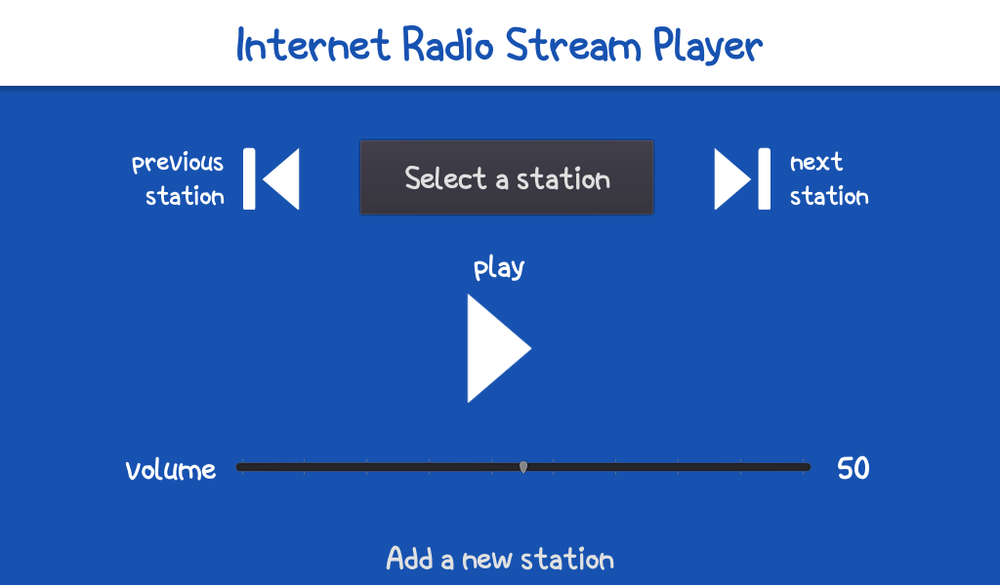

# RadioNet
A simple Internet Radio Player made with Godot Engine and C# for a working project.  
This project uses NAudio.dll, developed and maintained here -> [NAudio](https://github.com/naudio/NAudio)

